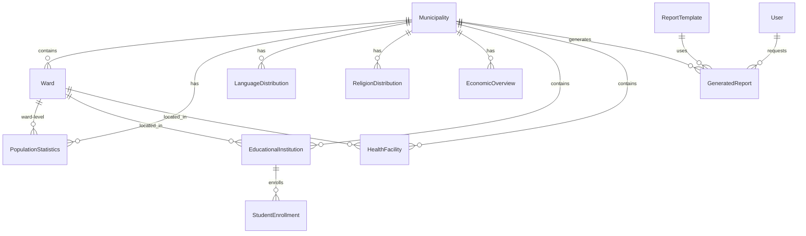

# Database Design & Models Specification

## Database Schema Overview

### Design Principles
- **Normalization**: Proper 3NF structure to eliminate redundancy
- **Localization**: All text fields support Nepali Unicode
- **Audit Trail**: Track creation, modification, and user actions
- **Scalability**: Designed to handle multiple municipalities
- **Data Integrity**: Foreign key constraints and validations

## Core Models

### 1. Municipality Model
```python
class Municipality(models.Model):
    """
    Core municipality information
    """
    # Basic Information
    id = models.UUIDField(primary_key=True, default=uuid.uuid4)
    name = models.CharField(max_length=200)
    name_nepali = models.CharField(max_length=200)
    code = models.CharField(max_length=20, unique=True)
    
    # Classification
    MUNICIPALITY_TYPES = [
        ('municipality', 'नगरपालिका'),
        ('sub_metropolitan', 'उप-महानगरपालिका'),
        ('metropolitan', 'महानगरपालिका'),
        ('rural_municipality', 'गाउँपालिका'),
    ]
    type = models.CharField(max_length=20, choices=MUNICIPALITY_TYPES)
    
    # Location
    province = models.CharField(max_length=100)
    province_nepali = models.CharField(max_length=100)
    district = models.CharField(max_length=100)
    district_nepali = models.CharField(max_length=100)
    
    # Geographic Info
    latitude = models.DecimalField(max_digits=10, decimal_places=7, null=True)
    longitude = models.DecimalField(max_digits=10, decimal_places=7, null=True)
    area_sq_km = models.DecimalField(max_digits=10, decimal_places=2)
    altitude_meters = models.IntegerField(null=True)
    
    # Administrative
    establishment_date = models.DateField()
    wards_count = models.IntegerField()
    headquarters = models.CharField(max_length=200)
    headquarters_nepali = models.CharField(max_length=200)
    
    # Contact Information
    website = models.URLField(blank=True)
    email = models.EmailField(blank=True)
    phone = models.CharField(max_length=20, blank=True)
    
    # Metadata
    created_at = models.DateTimeField(auto_now_add=True)
    updated_at = models.DateTimeField(auto_now=True)
    created_by = models.ForeignKey(User, on_delete=models.SET_NULL, null=True)
    
    class Meta:
        verbose_name = "Municipality"
        verbose_name_plural = "Municipalities"
        ordering = ['name']
```

### 2. Ward Model
```python
class Ward(models.Model):
    """
    Ward information within municipality
    """
    municipality = models.ForeignKey(Municipality, on_delete=models.CASCADE, related_name='wards')
    number = models.IntegerField()
    name = models.CharField(max_length=200, blank=True)
    name_nepali = models.CharField(max_length=200, blank=True)
    
    # Geographic boundaries (simplified - could be GeoJSON)
    boundary_coordinates = models.JSONField(null=True, blank=True)
    area_sq_km = models.DecimalField(max_digits=8, decimal_places=2, null=True)
    
    # Administrative
    office_location = models.CharField(max_length=500, blank=True)
    office_location_nepali = models.CharField(max_length=500, blank=True)
    
    created_at = models.DateTimeField(auto_now_add=True)
    updated_at = models.DateTimeField(auto_now=True)
    
    class Meta:
        unique_together = ['municipality', 'number']
        ordering = ['municipality', 'number']
```

## Demographics Models (Chapter 3)

### 3. Population Statistics
```python
class PopulationStatistics(models.Model):
    """
    Population data by various demographics
    """
    municipality = models.ForeignKey(Municipality, on_delete=models.CASCADE)
    ward = models.ForeignKey(Ward, on_delete=models.CASCADE, null=True, blank=True)
    data_year = models.IntegerField()
    
    # Total Population
    total_population = models.IntegerField()
    male_population = models.IntegerField()
    female_population = models.IntegerField()
    other_population = models.IntegerField(default=0)
    
    # Households
    total_households = models.IntegerField()
    average_household_size = models.DecimalField(max_digits=4, decimal_places=2)
    
    # Age Groups
    age_0_4 = models.IntegerField(default=0)
    age_5_14 = models.IntegerField(default=0)
    age_15_24 = models.IntegerField(default=0)
    age_25_59 = models.IntegerField(default=0)
    age_60_plus = models.IntegerField(default=0)
    
    # Education
    literate_population = models.IntegerField(default=0)
    literacy_rate = models.DecimalField(max_digits=5, decimal_places=2)
    
    created_at = models.DateTimeField(auto_now_add=True)
    updated_at = models.DateTimeField(auto_now=True)
    
    class Meta:
        unique_together = ['municipality', 'ward', 'data_year']
```

### 4. Language Distribution
```python
class LanguageDistribution(models.Model):
    """
    Mother tongue distribution
    """
    municipality = models.ForeignKey(Municipality, on_delete=models.CASCADE)
    language_name = models.CharField(max_length=100)
    language_name_nepali = models.CharField(max_length=100)
    population_count = models.IntegerField()
    percentage = models.DecimalField(max_digits=5, decimal_places=2)
    data_year = models.IntegerField()
    
    class Meta:
        unique_together = ['municipality', 'language_name', 'data_year']
```

### 5. Religion Distribution
```python
class ReligionDistribution(models.Model):
    """
    Religious affiliation distribution
    """
    municipality = models.ForeignKey(Municipality, on_delete=models.CASCADE)
    religion_name = models.CharField(max_length=100)
    religion_name_nepali = models.CharField(max_length=100)
    population_count = models.IntegerField()
    percentage = models.DecimalField(max_digits=5, decimal_places=2)
    data_year = models.IntegerField()
    
    class Meta:
        unique_together = ['municipality', 'religion_name', 'data_year']
```

### 6. Caste/Ethnicity Distribution
```python
class CasteEthnicityDistribution(models.Model):
    """
    Caste and ethnicity distribution
    """
    municipality = models.ForeignKey(Municipality, on_delete=models.CASCADE)
    caste_ethnicity = models.CharField(max_length=100)
    caste_ethnicity_nepali = models.CharField(max_length=100)
    
    CATEGORY_CHOICES = [
        ('brahmin_chhetri', 'ब्राह्मण/क्षत्री'),
        ('janajati', 'जनजाति'),
        ('madhesi', 'मधेशी'),
        ('dalit', 'दलित'),
        ('muslim', 'मुस्लिम'),
        ('others', 'अन्य'),
    ]
    category = models.CharField(max_length=20, choices=CATEGORY_CHOICES)
    
    population_count = models.IntegerField()
    percentage = models.DecimalField(max_digits=5, decimal_places=2)
    data_year = models.IntegerField()
    
    class Meta:
        unique_together = ['municipality', 'caste_ethnicity', 'data_year']
```

## Economics Models (Chapter 4)

### 7. Economic Overview
```python
class EconomicOverview(models.Model):
    """
    General economic indicators
    """
    municipality = models.ForeignKey(Municipality, on_delete=models.CASCADE)
    data_year = models.IntegerField()
    
    # Income and Expenditure
    average_annual_income = models.DecimalField(max_digits=12, decimal_places=2)
    average_annual_expenditure = models.DecimalField(max_digits=12, decimal_places=2)
    poverty_rate = models.DecimalField(max_digits=5, decimal_places=2)
    
    # Employment
    economically_active_population = models.IntegerField()
    unemployment_rate = models.DecimalField(max_digits=5, decimal_places=2)
    
    # Foreign Employment
    foreign_employment_count = models.IntegerField(default=0)
    remittance_amount = models.DecimalField(max_digits=15, decimal_places=2, null=True)
    
    created_at = models.DateTimeField(auto_now_add=True)
    updated_at = models.DateTimeField(auto_now=True)
    
    class Meta:
        unique_together = ['municipality', 'data_year']
```

### 8. Agriculture Production
```python
class AgricultureProduction(models.Model):
    """
    Agricultural production data
    """
    municipality = models.ForeignKey(Municipality, on_delete=models.CASCADE)
    crop_name = models.CharField(max_length=100)
    crop_name_nepali = models.CharField(max_length=100)
    
    CROP_CATEGORIES = [
        ('cereal', 'अन्न बाली'),
        ('cash_crop', 'नगदी बाली'),
        ('vegetable', 'तरकारी'),
        ('fruit', 'फलफूल'),
        ('spices', 'मसला'),
    ]
    category = models.CharField(max_length=20, choices=CROP_CATEGORIES)
    
    # Production Data
    cultivated_area_hectare = models.DecimalField(max_digits=10, decimal_places=2)
    production_metric_ton = models.DecimalField(max_digits=10, decimal_places=2)
    productivity_per_hectare = models.DecimalField(max_digits=8, decimal_places=2)
    
    # Seasons
    SEASON_CHOICES = [
        ('spring', 'चैत'),
        ('summer', 'बैशाख'),
        ('monsoon', 'आषाढ'),
        ('autumn', 'आश्विन'),
        ('winter', 'मंसिर'),
    ]
    growing_season = models.CharField(max_length=20, choices=SEASON_CHOICES)
    
    data_year = models.IntegerField()
    created_at = models.DateTimeField(auto_now_add=True)
```

### 9. Livestock Data
```python
class LivestockData(models.Model):
    """
    Livestock and poultry data
    """
    municipality = models.ForeignKey(Municipality, on_delete=models.CASCADE)
    animal_type = models.CharField(max_length=100)
    animal_type_nepali = models.CharField(max_length=100)
    
    ANIMAL_CATEGORIES = [
        ('cattle', 'गाईवस्तु'),
        ('buffalo', 'भैंसी'),
        ('goat', 'बाख्रा'),
        ('sheep', 'भेडा'),
        ('pig', 'सुंगुर'),
        ('poultry', 'कुखुरा'),
        ('duck', 'हाँस'),
    ]
    category = models.CharField(max_length=20, choices=ANIMAL_CATEGORIES)
    
    population_count = models.IntegerField()
    production_value = models.DecimalField(max_digits=12, decimal_places=2, null=True)
    data_year = models.IntegerField()
    
    class Meta:
        unique_together = ['municipality', 'animal_type', 'data_year']
```

## Social Services Models (Chapter 5)

### 10. Educational Institutions
```python
class EducationalInstitution(models.Model):
    """
    Schools and educational facilities
    """
    municipality = models.ForeignKey(Municipality, on_delete=models.CASCADE)
    ward = models.ForeignKey(Ward, on_delete=models.CASCADE)
    name = models.CharField(max_length=200)
    name_nepali = models.CharField(max_length=200)
    
    INSTITUTION_TYPES = [
        ('ecd', 'बाल विकास केन्द्र'),
        ('primary', 'आधारभूत विद्यालय'),
        ('secondary', 'माध्यमिक विद्यालय'),
        ('higher_secondary', 'उच्च माध्यमिक विद्यालय'),
        ('campus', 'क्याम्पस'),
        ('technical', 'प्राविधिक शिक्षालय'),
    ]
    institution_type = models.CharField(max_length=20, choices=INSTITUTION_TYPES)
    
    MANAGEMENT_TYPES = [
        ('community', 'सामुदायिक'),
        ('institutional', 'संस्थागत'),
        ('religious', 'धार्मिक'),
    ]
    management_type = models.CharField(max_length=20, choices=MANAGEMENT_TYPES)
    
    # Infrastructure
    total_classrooms = models.IntegerField(default=0)
    computer_lab = models.BooleanField(default=False)
    library = models.BooleanField(default=False)
    playground = models.BooleanField(default=False)
    
    # Contact
    address = models.TextField()
    phone = models.CharField(max_length=20, blank=True)
    email = models.EmailField(blank=True)
    
    established_year = models.IntegerField(null=True)
    created_at = models.DateTimeField(auto_now_add=True)
```

### 11. Student Enrollment
```python
class StudentEnrollment(models.Model):
    """
    Student enrollment data by institution
    """
    institution = models.ForeignKey(EducationalInstitution, on_delete=models.CASCADE)
    academic_year = models.CharField(max_length=10)  # e.g., "2080-81"
    grade_level = models.CharField(max_length=20)
    
    male_students = models.IntegerField(default=0)
    female_students = models.IntegerField(default=0)
    total_students = models.IntegerField()
    
    # Special categories
    dalit_students = models.IntegerField(default=0)
    janajati_students = models.IntegerField(default=0)
    disabled_students = models.IntegerField(default=0)
    
    class Meta:
        unique_together = ['institution', 'academic_year', 'grade_level']
```

### 12. Health Facilities
```python
class HealthFacility(models.Model):
    """
    Health institutions and services
    """
    municipality = models.ForeignKey(Municipality, on_delete=models.CASCADE)
    ward = models.ForeignKey(Ward, on_delete=models.CASCADE)
    name = models.CharField(max_length=200)
    name_nepali = models.CharField(max_length=200)
    
    FACILITY_TYPES = [
        ('hospital', 'अस्पताल'),
        ('health_post', 'स्वास्थ्य चौकी'),
        ('sub_health_post', 'उप स्वास्थ्य चौकी'),
        ('primary_health_center', 'प्राथमिक स्वास्थ्य केन्द्र'),
        ('ayurveda_center', 'आयुर्वेद केन्द्र'),
        ('private_clinic', 'निजी क्लिनिक'),
    ]
    facility_type = models.CharField(max_length=30, choices=FACILITY_TYPES)
    
    # Services Available
    emergency_service = models.BooleanField(default=False)
    maternity_service = models.BooleanField(default=False)
    laboratory_service = models.BooleanField(default=False)
    pharmacy = models.BooleanField(default=False)
    ambulance_service = models.BooleanField(default=False)
    
    # Capacity
    bed_capacity = models.IntegerField(default=0)
    doctor_count = models.IntegerField(default=0)
    nurse_count = models.IntegerField(default=0)
    
    address = models.TextField()
    phone = models.CharField(max_length=20, blank=True)
    
    established_year = models.IntegerField(null=True)
    created_at = models.DateTimeField(auto_now_add=True)
```

## Infrastructure Models (Chapter 7)

### 13. Road Infrastructure
```python
class RoadInfrastructure(models.Model):
    """
    Road network data
    """
    municipality = models.ForeignKey(Municipality, on_delete=models.CASCADE)
    name = models.CharField(max_length=200)
    name_nepali = models.CharField(max_length=200)
    
    ROAD_TYPES = [
        ('highway', 'राजमार्ग'),
        ('feeder', 'फिडर सडक'),
        ('rural', 'ग्रामीण सडक'),
        ('urban', 'शहरी सडक'),
        ('trail', 'ट्रेल'),
    ]
    road_type = models.CharField(max_length=20, choices=ROAD_TYPES)
    
    SURFACE_TYPES = [
        ('blacktopped', 'कालोपत्रे'),
        ('graveled', 'ढुंगामाटो'),
        ('earthen', 'कच्ची'),
    ]
    surface_type = models.CharField(max_length=20, choices=SURFACE_TYPES)
    
    length_km = models.DecimalField(max_digits=8, decimal_places=2)
    width_meters = models.DecimalField(max_digits=5, decimal_places=2, null=True)
    
    # Condition
    CONDITION_CHOICES = [
        ('excellent', 'उत्कृष्ट'),
        ('good', 'राम्रो'),
        ('fair', 'मध्यम'),
        ('poor', 'खराब'),
    ]
    condition = models.CharField(max_length=20, choices=CONDITION_CHOICES)
    
    construction_year = models.IntegerField(null=True)
    last_maintenance = models.DateField(null=True)
    
    created_at = models.DateTimeField(auto_now_add=True)
```

### 14. Energy Infrastructure
```python
class EnergyInfrastructure(models.Model):
    """
    Energy and power infrastructure
    """
    municipality = models.ForeignKey(Municipality, on_delete=models.CASCADE)
    
    # Electricity Access
    households_with_electricity = models.IntegerField()
    total_households = models.IntegerField()
    electrification_rate = models.DecimalField(max_digits=5, decimal_places=2)
    
    # Power Sources
    grid_connected_households = models.IntegerField(default=0)
    solar_households = models.IntegerField(default=0)
    micro_hydro_households = models.IntegerField(default=0)
    generator_households = models.IntegerField(default=0)
    
    # Alternative Energy
    biogas_households = models.IntegerField(default=0)
    improved_cookstove_households = models.IntegerField(default=0)
    
    data_year = models.IntegerField()
    
    class Meta:
        unique_together = ['municipality', 'data_year']
```

## Report Generation Models

### 15. Report Template
```python
class ReportTemplate(models.Model):
    """
    Report generation templates
    """
    name = models.CharField(max_length=200)
    name_nepali = models.CharField(max_length=200)
    description = models.TextField()
    
    # Template Configuration
    chapters_included = models.JSONField()  # List of chapter codes
    template_file = models.FileField(upload_to='report_templates/')
    css_file = models.FileField(upload_to='report_styles/', null=True, blank=True)
    
    is_active = models.BooleanField(default=True)
    created_at = models.DateTimeField(auto_now_add=True)
    updated_at = models.DateTimeField(auto_now=True)
```

### 16. Generated Report
```python
class GeneratedReport(models.Model):
    """
    Track generated reports
    """
    id = models.UUIDField(primary_key=True, default=uuid.uuid4)
    municipality = models.ForeignKey(Municipality, on_delete=models.CASCADE)
    template = models.ForeignKey(ReportTemplate, on_delete=models.CASCADE)
    
    # Report Configuration
    title = models.CharField(max_length=300)
    title_nepali = models.CharField(max_length=300)
    chapters_included = models.JSONField()
    data_year = models.IntegerField()
    
    # Generation Status
    STATUS_CHOICES = [
        ('pending', 'Pending'),
        ('processing', 'Processing'),
        ('completed', 'Completed'),
        ('failed', 'Failed'),
    ]
    status = models.CharField(max_length=20, choices=STATUS_CHOICES, default='pending')
    
    # Files
    pdf_file = models.FileField(upload_to='generated_reports/', null=True, blank=True)
    html_file = models.FileField(upload_to='generated_reports/', null=True, blank=True)
    
    # Metadata
    file_size_bytes = models.BigIntegerField(null=True)
    generation_time_seconds = models.DecimalField(max_digits=8, decimal_places=2, null=True)
    error_message = models.TextField(blank=True)
    
    requested_by = models.ForeignKey(User, on_delete=models.SET_NULL, null=True)
    created_at = models.DateTimeField(auto_now_add=True)
    completed_at = models.DateTimeField(null=True)
```

## Data Relationships Diagram



## Database Indexing Strategy

### Primary Indexes
```sql
-- Performance critical indexes
CREATE INDEX idx_population_municipality_year ON core_populationstatistics(municipality_id, data_year);
CREATE INDEX idx_economic_municipality_year ON core_economicoverview(municipality_id, data_year);
CREATE INDEX idx_institutions_municipality_type ON core_educationalinstitution(municipality_id, institution_type);
CREATE INDEX idx_health_municipality_type ON core_healthfacility(municipality_id, facility_type);
CREATE INDEX idx_reports_municipality_status ON core_generatedreport(municipality_id, status);

-- Search indexes
CREATE INDEX idx_municipality_name ON core_municipality(name);
CREATE INDEX idx_municipality_name_nepali ON core_municipality(name_nepali);
CREATE INDEX idx_institution_name ON core_educationalinstitution(name);
CREATE INDEX idx_health_name ON core_healthfacility(name);
```

### Query Optimization Examples
```python
# Optimized queries with select_related and prefetch_related
municipality = Municipality.objects.select_related('created_by').get(id=municipality_id)

population_data = PopulationStatistics.objects.filter(
    municipality=municipality,
    data_year=2081
).select_related('ward')

institutions = EducationalInstitution.objects.filter(
    municipality=municipality
).prefetch_related('studentenrollment_set').select_related('ward')
```
